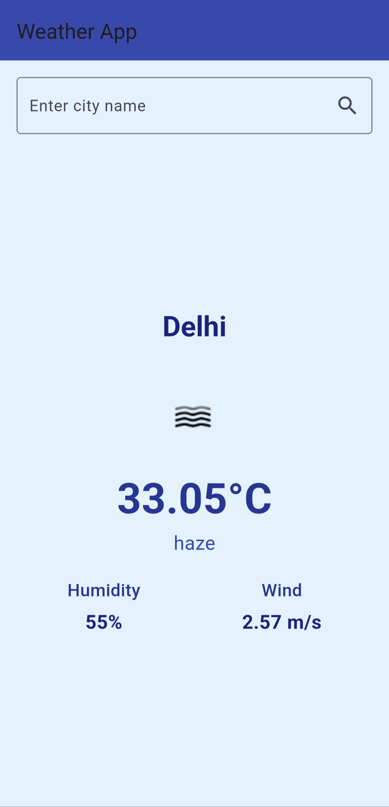

 

# Weather App

A simple Flutter weather application that fetches and displays weather data for a given city using the OpenWeatherMap API.

## Features
- Displays current temperature, weather condition, humidity, and wind speed.
- User can search for weather information by entering the name of a city.
- Provides a loading indicator while fetching the data.
- Handles errors gracefully if data fetch fails.

## Screenshot


## Getting Started

### Prerequisites
To run this app, you will need:
- [Flutter SDK](https://flutter.dev/docs/get-started/install)
- A valid API key from [OpenWeatherMap](https://home.openweathermap.org/users/sign_up)

### Installation

1. Clone the repository:

```
git clone https://github.com/yourusername/weather_app.git
```
Navigate to the project directory:
```
cd weather_app
```
Install the required dependencies:

```
flutter pub get
```
## Set up your OpenWeatherMap API key:

Open lib/services/weather_service.dart
Replace 'c785c5e4c456aca46f7931e42daeb428' with your own API key.
```
final String apiKey = 'your_api_key'; // Add your API key here
```
## Running the App

Run the app using the Flutter command:
```
flutter run
```
The app will launch on your connected device or emulator. You can enter the name of any city to fetch the current weather data.

## Troubleshooting

If you encounter any issues during the setup or running the app, make sure to check the following:

Ensure you have a stable internet connection.
Verify that your API key is valid and has not exceeded the request limit.
Ensure that the Flutter SDK is correctly installed.

## Built With

* Flutter - UI toolkit for building natively compiled applications for mobile, web, and desktop from a single codebase.
* OpenWeatherMap - Free weather data API.

## Thanks to OpenWeatherMap for providing the weather data API.# weather_app
